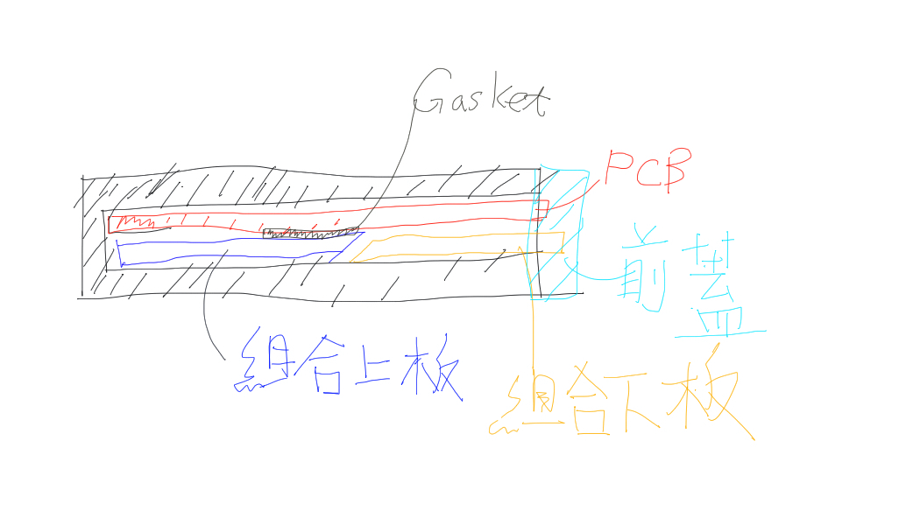

# Tetsuo 65
鐵雄65
主要設計為概念為利用滑槽式的設計，設計出一體成型的Case. 以及雙USBC插孔。 

1. Gasket PCB Mounting System
整體鍵盤的結構為前蓋 本體 pcb組合上板以及組合下板。 
組合上板與下版的用意為減少滑槽內的空間，來達到夾住PCB板的功能，組合板的材質為PC或是POM。
共有兩種方案。一種為斜切面的方案，此方案是為方便安裝所設計。

可以看到上板與下板間有個傾斜的接口這是為了使原本安裝的gasket有空間，不會因為已安裝了gasket使原本的空間變得過小使安裝困難。
上板安裝完後在安裝下板，因為上下板間是有個斜切面這樣可以使上板被下板逐漸往上推。

